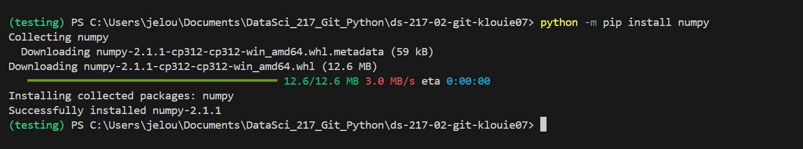

# DATASCI 217

## Links:

[Official Python Site](https://www.python.org)

## Assignment 1

### Prompt:

If we list all the natural numbers below 10 that are multiples of 3 or 5, we get (3, 5, 6, 9). 
The sum of these multiples is 23. Find the sum of all the multiples of 3 or 5 below 1000.

### Solution: 
```python
values = [0]

for x in range(1001):
    if x % 3 == 0:
        values.append(x)
    elif x % 5 == 0:
        values.append(x)
    
sumval = sum(values)

print(sumval)
```

## Photos practice: 



*Hover image*

[](https://www.youtube.com/watch?v=dQw4w9WgXcQ)

